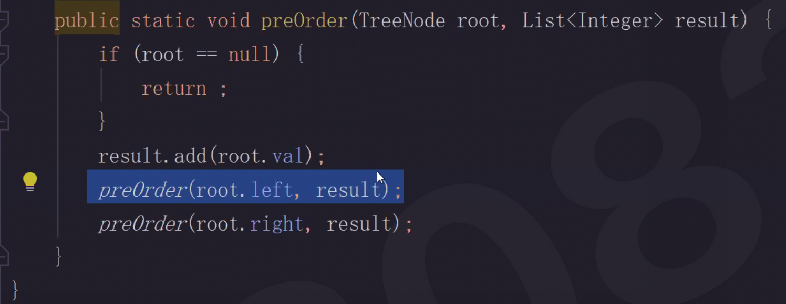

# Section1.1 Reference, Deep Copy and Shallow Copy

## Reference



```python
>>> b = [1 , 2]
>>> a = [b, 3, 4]
>>>
>>> c = a
>>> print c
[[1, 2], 3, 4]
>>> id(a)
4408148552
>>> id(c)
4408148552
```

c = a 表示 c 和 a 指向相同的地址空间，并没有创建新的对象。

## Shallow Copy


```python
>>> import copy
>>> d = copy.copy(a)
>>> print d
[[1, 2], 3, 4]
>>>
>>> id(a)
4408148552
>>> id(d)
4408199792
>>>
>>> id(a[0])
4408022944
>>> id(d[0])
4408022944
>>>
>>> d[0][0] = 5
>>> print a
>>> [[5, 2], 3, 4]
```

d = copy.copy\(a\) 创建了一个新对象，复制了原有对象的引用。


## Deep Copy


```python
>>> e = copy.deepcopy(a)
>>> print e
>>> [[1, 2], 3, 4]
>>>
>>> id(a)
>>> 4408148552
>>> id(e)
>>> 4408394792
>>>
>>> id(a[0])
>>> 4408022944
>>> id(e[0])
>>> 4408398432
>>>
>>> e[0][0] = 5
>>> print a
>>> [[1, 2], 3, 4]
```

e = copy.deepcopy\(a\) 新建了一个新对象，完整的在内存中复制原有对象。

The difference between shallow and deep copying is only relevant for compound objects \(objects that contain other objects, like lists or class instances\):

* A shallow copy constructs a new compound object and then \(to the extent possible\) inserts references into it to the objects found in the original.
* A deep copy constructs a new compound object and then, recursively, inserts copies into it of the objects found in the original.



```python
a = [1, 22]
b = a[:]
b[0] = 3

print(a)
```



使用深拷贝时，需要注意以下两个问题:

* 递归对象拷贝: Recursive objects \(compound objects that, directly or indirectly, contain a reference to themselves\) may cause a recursive loop.
* 大对象拷贝: Because deep copy copies everything it may copy too much, e.g., administrative data structures that should be shared even between copies.

